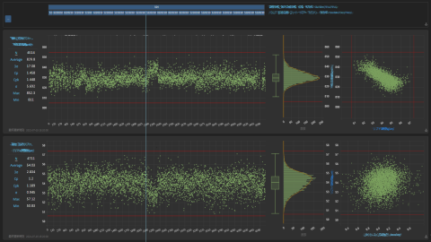
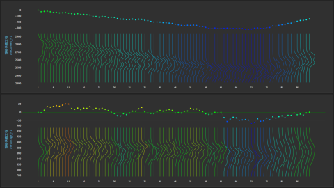
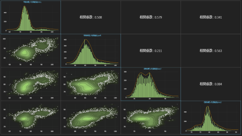
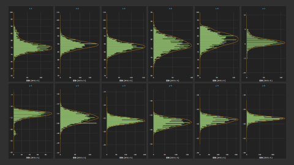

# Analysis Platform

Analysis Platform is an open source web application to import, connect and visualize factory IoT data. It helps to collect, link and integrate data from multiple data sources.
Visualizations include Digital Native QC7 Tools, which is designed especially suitable for data on manufacturing domain.
Let's try data-driven process improvement by utilizing the data sleeping in the field.

<table border="0">
<tr>
<td></td>
<td></td>
<td></td>
</tr>
<tr>
<td></td>
<td></td>
<td></td>
</tr>
</table>

## What can we do with Analysis Platform?

The main activities that user can take with Analysis Platform are:

* Check behavior of time-series or id-series data, stratify across processes (Full Points Plot)
* Check behavior of fluctuation of the distribution (Ridgeline Plot)
* Check correlation between variables and clusters in distribution (Multiple Scatter Plot)
* Check behavior of each category/group (Stratified Plot)
* Check behavior of related to human activities & process and product behavior (Calendar Heatmap)
* Look for key variables that strongly relates to output (Sankey Diagram)
* Grasp phenomenon that occurs at the same time (Cooccurrence Graph)

Analysis Platform currently supports following data sources:  

* CSV/TSV/SSV(semicolon)
* SQLite
* MySQL
* PostgreSQL
* SQL Server
* Oracle Database

## Terms of Use

On your first access to the application, you must read and agree to [Terms of Use](/about/terms_of_use_en.md) shown on modal screen.  
If you are going to use "`oss_start_app.bat`" to run Analysis Platform with
Windows embeddable package,  
running the batch file is regarded as you agreed to the Terms of Use.

## Requirements

Analysis Platform uses [Flask](https://flask.palletsprojects.com/en/latest/) framework. 

- Python (>=3.6) (Tested with Python 3.7.3)


## How can we start using Analysis Platform? 

First, pull this repository to your PC.  

```shell
git clone https://github.com/apdn7/AnalysisPlatform.git
cd AnalysisPlatform
```

or you can download zip file and unzip it.  
For detailed instruction, you can refer below documents:

- EN: [Setup Manual](https://github.com/apdn7/AnalysisPlatform/files/9314730/AP%2BDN7_setup_manual_EN_v1.0.pdf) / [Data Import & Link Settings](https://github.com/apdn7/AnalysisPlatform/files/9806411/AP%2BDN7_Setting_Manual_En0.pdf) / [FPP](https://github.com/apdn7/AnalysisPlatform/files/9806413/AP%2BDN7_User_Manual_FPP_En.pdf) / [FAQ](https://github.com/apdn7/AnalysisPlatform/files/9314734/AP%2BDN7_FAQ_EN_v1.0.pdf) / [Quick reference](https://github.com/apdn7/AnalysisPlatform/files/9314737/AP%2BDN7_v4.0_QuickReference_EN.pdf)
- JP: [Setup Manual](https://github.com/apdn7/AnalysisPlatform/files/9256466/AP%2BDN7_setup_manual_JP_v1.0.pdf) / [Data Import & Link Settings](https://github.com/apdn7/AnalysisPlatform/files/9806412/AP%2BDN7_Setting_Manual_Ver1.0_Jp.pdf) / [FPP](https://github.com/apdn7/AnalysisPlatform/files/9806414/AP-DN7_FPP_Jp0.pdf) / [FAQ](https://github.com/apdn7/AnalysisPlatform/files/9256487/AP%2BDN7_FAQ_JP_v1.0.pdf) / [Quick reference](https://github.com/apdn7/AnalysisPlatform/files/9314735/AP%2BDN7_v4.0_QuickReference_JP.pdf)


### For users: Run Analysis Platform with Windows embeddable package

If you use Windows machine, you can use Windows
embeddable package to run Analysis Platform 
without installing python.

```
Note:
Avoid placing Analysis Platform in the folder where synchronized with OneDrive.
Analysis Platform generates buffer database/files, thus the synchronization 
might hinder the performance or can overload the network.
```

To download necessary packages and activate Analysis Platform,
you can run "`oss_start_app.bat`" (beforehand, read [Terms of Use](/about/terms_of_use_en.md) carefully).

```
Double click "oss_start_app.bat"
```

This batch file will automatically
download:

* [Windows embeddable package](https://www.python.org/downloads/windows/): To run Analysis Platform without installing Python
* [pip](https://github.com/pypa/pip): To manage Python packages
* [other necessary python packages](requirements/common.txt): To run Analysis Platform
* [Oracle Instant Client](https://www.oracle.com/database/technologies/instant-client.html): To connect Oracle Database

```
Note:
If you are connecting internet using proxy, 
you might have to edit "oss_start_app.bat" and specify the address unless it is registered in your environmental variable.
Open "oss_start_app.bat" with any text editor, and you will find
proxy setting on row 7-8. Remove REM from those rows and fill in HTTP_PROXY and HTTPS_PROXY.
```

Analysis Platform is activated after all downloads are finished.

Analysis Platform uses Port 6868 by default.  
Access below URL to access Analysis Platform.
If another program already uses port 6868, you can change the setting (See Basic Settings).

```
http://127.0.0.1:6868/
```

Downloads are only excecuted only if above files were not detected, so you can use use "`oss_start_app.bat`" for the next activation. (Analysis platform detects a folder named `python_embedded`on the same level as `AnalysisPlatform`)

Analysis Platform can run without internet connection.
If you want to use this application on machine which has no internet connection (for example, intranet),
you can first download all required files on other machine (which has internet connection),
then copy entire files.

### For developers: Run Analysis Platform with Python installed on your machine

Install requirements:

```shell
pip install -r requirements/common.txt
```
If pip install fails, try using Python 3.7.3.  
Analysis Platform is activated by following command

```bash
python main.py
```

Corresponding ODBC driver must be installed to use SQL Server and Oracle Database.


## How do we shut down Analysis Platform?

To shut down Analysis Platform,   
press shut down button on bottom of sidebar (this button is only available on host machine),  
or you can press `Ctrl + C` on your console.

## Basic Settings

Basic settings of Analysis Platform is defined in 
`info` field of `histview2/config/basic_config.yml`.
You can open the file with any text editor and set:

* `port-no`: Port number that Analysis Platform use (default: 6868)
* `language`: Language used in GUI. For example, if you want to use Japanese, set "JA". If empty or invalid value is set, English is used.  
See language selectbox on upper right corner of GUI for abbreviations of each language (default: empty)
* `hide-setting-page`: If True, hides link to config page (default: False)

If you want to initialize the application, remove `instance` folder and `histview2/config/basic_config.yml`.  
These files are generated on the next activation.

## Is there any sample data that we can use?

By default, Analysis Platform contains sample data and corresponding settings to get an overview of each visualization.  
Data is stored as TSV file under the subdirectories in [/sample_data](/sample_data):

* /assembly: Quality data
  * /1_parts_feed
    * 20220228.tsv
  * /2_inspection
    * 20220228.tsv 
* /parts_processing: Machine data
  * /1_machine_parameter_a
    * 20220311.tsv
  * /2_machine_parameter_b
    * 20220311.tsv
  * /3_finishing
    * 20220311.tsv
* /alarm_signal_cog: Daily occurence of machine alarms
  * 20200401.tsv

Above data will be automatically imported after activation.  
You can call each sample visualization from 'Load' or 'Bookmark' on upper right corner of GUI.

If you do not need those data,
you can either initialize the application by removing `instance`
folder before the activation,  
or you can just remove each data source setting from GUI.

## License

Analysis Platform is released under MIT License.  
See our [LICENSE](LICENSE.md) for more detail.
