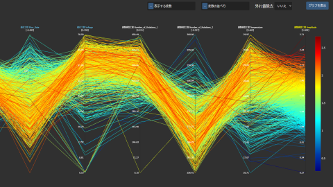
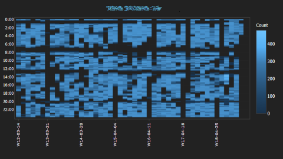
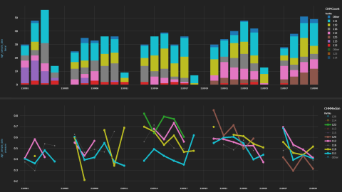
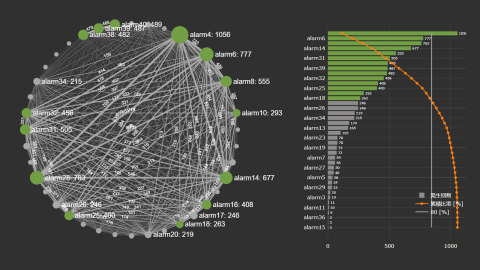
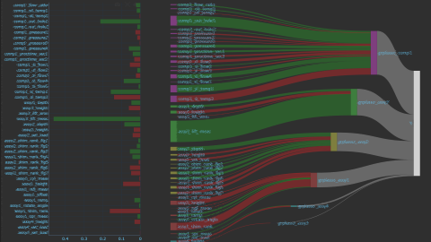
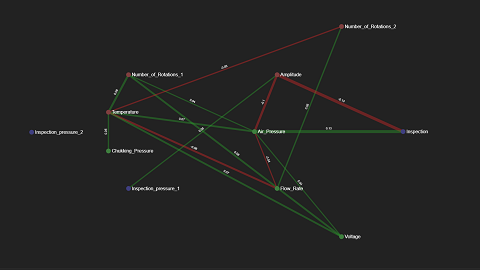

# Analysis Platform

```
2025-05-08: version 4.7.9
```

Analysis Platform is an open source web application to import, connect and visualize factory IoT data. It helps to collect, link and integrate data from multiple data sources.
Visualizations include Digital Native QC7 Tools, which is designed especially suitable for data on manufacturing domain.
Let's try data-driven process improvement by utilizing the data sleeping in the field.

<table border="0">
<tr>
<td></td>
<td></td>
<td></td>
</tr>
<tr>
<td></td>
<td></td>
<td></td>
</tr>
<tr>
<td></td>
<td></td>
<td></td>
</tr>
<tr>
<td></td>
<td></td>
<td></td>
</tr>
</table>

## What can we do with the Analysis Platform?

The main activities that user can take with the Analysis Platform are:

* Check behavior of time-series or id-series data, stratify across processes (Full Points Plot)
* Check behavior of fluctuation of the distribution (Ridgeline Plot)
* Check correlation between variables and clusters in distribution (Multiple Scatter Plot)
* Check behavior of each category/group (Stratified Plot)
* Check behavior of related to human activities & process and product behavior (Calendar Heatmap)
* Look for key variables that strongly relates to output (Sankey Diagram)
* Grasp phenomenon that occurs at the same time (Cooccurrence Graph)
* \+ many other useful visualizations

The Analysis Platform currently supports following data sources:  

* CSV/TSV/SSV(semicolon)
* SQLite
* MySQL
* PostgreSQL
* SQL Server
* Oracle Database

## Terms of Use

On your first access to the application, you must read and agree to [Terms of Use](/about/terms_of_use_en.md) shown on modal screen.  

## Requirements

* Windows (Tested with Windows 10), Windows Server
* Python (>=3.6) (Tested with Python 3.9.0, pip 22.2)
  * If you are going to use the Windows embeddable package, you do not have to install Python in your machine.  
  (See section: For users)

## Getting Started

You can install AP+DN7 on your PC using installer (batch file)

* [APDN7_installer.zip](https://github.com/user-attachments/files/17042671/APDN7_installer.zip)

For detailed instruction, please refer below documents (PDF):

* EN: [Getting Started](https://github.com/user-attachments/files/20101799/1_AP%2BDN7_GettingStarted_OSS_479_en.pdf) / [Data Import & Link Settings](https://github.com/apdn7/AnalysisPlatform/files/15073708/AP%2BDN7_Setting_Manual_461_En.pdf) / [FPP](https://github.com/apdn7/AnalysisPlatform/files/9806413/AP%2BDN7_User_Manual_FPP_En.pdf) / [FAQ](https://github.com/apdn7/AnalysisPlatform/files/9314734/AP%2BDN7_FAQ_EN_v1.0.pdf) / [Quick reference](https://github.com/apdn7/AnalysisPlatform/files/9314737/AP%2BDN7_v4.0_QuickReference_EN.pdf)
* JA: [Getting Started](https://github.com/user-attachments/files/20101798/1_AP%2BDN7_GettingStarted_OSS_479_ja.pdf) / [Data Import & Link Settings](https://github.com/apdn7/AnalysisPlatform/files/15074076/AP%2BDN7_Setting_Manual_461_jp.pdf) / [FPP](https://github.com/apdn7/AnalysisPlatform/files/9806414/AP-DN7_FPP_Jp0.pdf) / [FAQ](https://github.com/apdn7/AnalysisPlatform/files/9256487/AP%2BDN7_FAQ_JP_v1.0.pdf) / [Quick reference](https://github.com/apdn7/AnalysisPlatform/files/9314735/AP%2BDN7_v4.0_QuickReference_JP.pdf)

### For users

(See the document "Getting Started" for details)  
To activate AP+DN7, double click `start_ap.bat` file.  
The batch file will automatically download:

* [Windows embeddable package](https://www.python.org/downloads/windows/): To run Analysis Platform without installing Python
* [pip](https://github.com/pypa/pip): To manage Python packages
* [other necessary python packages](requirements/common.txt): To run Analysis Platform
* [Oracle Instant Client](https://www.oracle.com/database/technologies/instant-client.html): To connect Oracle Database

```plaintext
Note:
If you are connecting the internet using proxy server, 
you must edit "startup.ini" and specify the appropriate address in advance.
```

The Analysis Platform is activated after all downloads are finished.

The Analysis Platform uses Port 7770 by default.  
Open below URL to access the application.

```plaintext
http://localhost:7770/
```

Downloads are only excecuted only if above files were not detected, so you can use use "`start_ap.bat`" for the next activation. (The Analysis Platform detects a folder named `python_embedded_39` on the same level as `AnalysisPlatform-master`)

The Analysis Platform can run without internet connection.
If you want to use this application on machine which has no internet connection (for example, intranet),
you can first download all required files on other machine (which has internet connection),
then copy entire files.

### For developers: Run Analysis Platform with Python installed on your machine

The Analysis Platform uses [Flask](https://flask.palletsprojects.com/en/latest/) framework.

* Python (>=3.6) (Tested with Python 3.9.0)

First, pull this repository to your PC.  

```shell
git clone https://github.com/apdn7/AnalysisPlatform.git
cd AnalysisPlatform
```

Then, install requirements:

```shell
pip install -r requirements/common.txt
```

If pip install fails, try using Python 3.9.0.  
Analysis Platform is activated by following command

```bash
python main.py
```

Corresponding ODBC driver must be installed to use SQL Server and Oracle Database.

## How do we shut down Analysis Platform?

To shut down the Analysis Platform,  
press shut down button on bottom of sidebar.  
(this button is only available on host machine, by accessing the application with `localhost:{port_no}`.)  

## Uninstall

To uninstall the Analysis Platform:

1. Remove the Analysis Platform folder (the folder which the `start_ap.bat` is included)
2. Remove the following files/folders:
   * `env`
   * `get-pip.py`
   * `python_embedded_39`
   * `Oracle-Portable`

## Updates

You can check [release notes](RELEASE.md) for new features and bugfixes.

## Is there any sample data that we can use?

By default, the Analysis Platform contains sample data and corresponding settings to get an overview of each visualization.  
Data is stored as TSV file under the subdirectories in [/sample_data](/sample_data):

* /assembly: Quality data
  * /1_parts_feed
    * 20220228.tsv
  * /2_inspection
    * 20220228.tsv
* /parts_processing: Machine data
  * /1_machine_parameter_a
    * 20220311.tsv
  * /2_machine_parameter_b
    * 20220311.tsv
  * /3_finishing
    * 20220311.tsv
* /COG_sample_data: Occurence of machine alarms
  * alarm_every_15minutes.tsv
  * alarm_daily.tsv
* /AgP_sample_data: PartNo, Ok/NG, NG_Mode, and pressure data
  * AgP_sample.tsv

Above data will be automatically imported after activation.  
You can call each sample visualization from 'Load' or 'Bookmark' on upper right corner of GUI.

If you do not need those data,
you can either initialize the application by removing `instance`
folder before the activation,  
or you can just remove each data source setting from GUI.

## License

* The Analysis Platform is released under MIT License. See our [LICENSE](LICENSE.md) for more detail.
* The document of section: Educational materials is released under [CC BY-NC-ND 4.0](https://creativecommons.org/licenses/by-nc-nd/4.0/).
* The data set of section: Educational materials is released under [CDLA-Sharing-1.0](https://cdla.dev/sharing-1-0/).

## Educational materials

You can get some materials to use for educating AP+DN7.

* [APDN7_eduational_materials.zip](https://github.com/apdn7/AnalysisPlatform/releases/download/v4.7.8/APDN7_educational_materials.zip): This file includes following materials
  * Document (JA): Basic introduction of AP+DN7 and task description of hands-on data analysis
  * Toy data set (`instance folder` = Data pre-imported into AP+DN7)